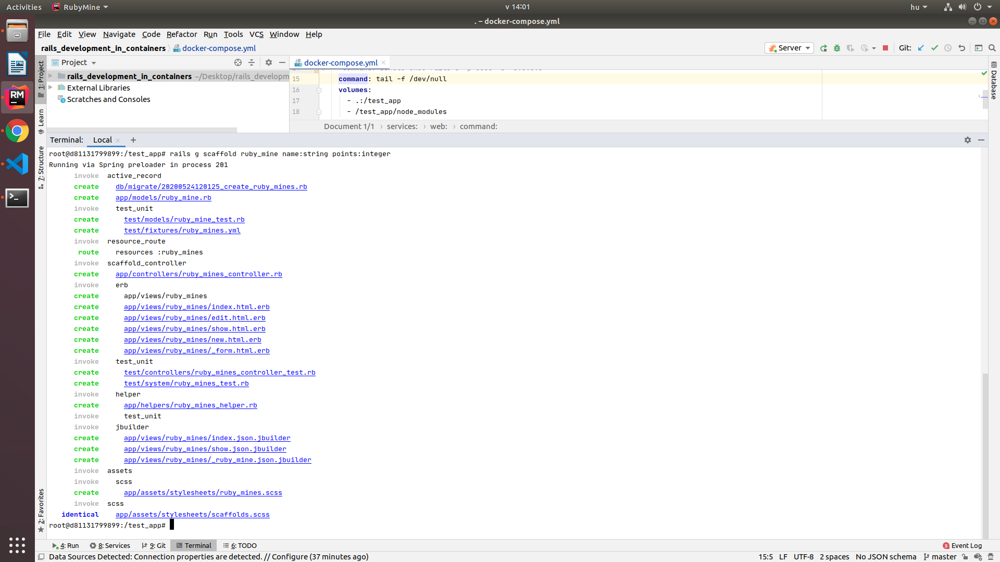
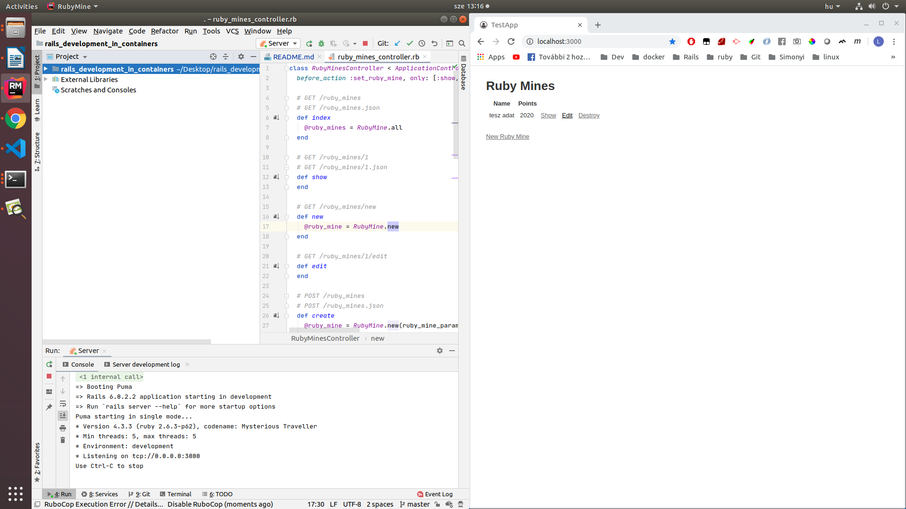
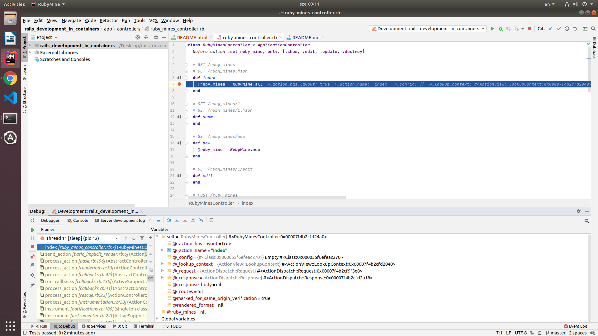
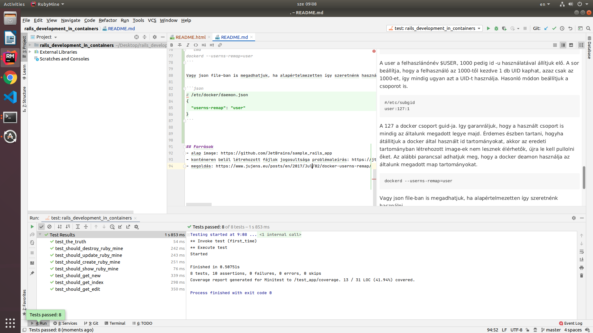
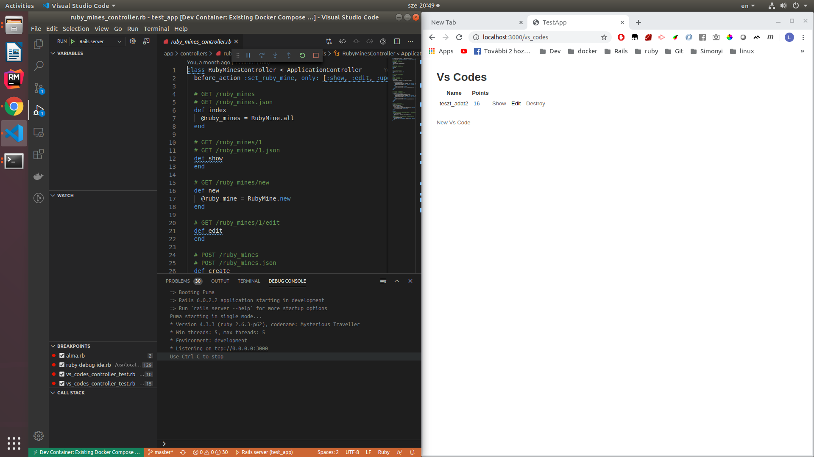
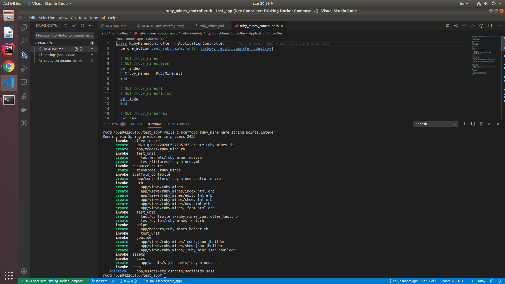
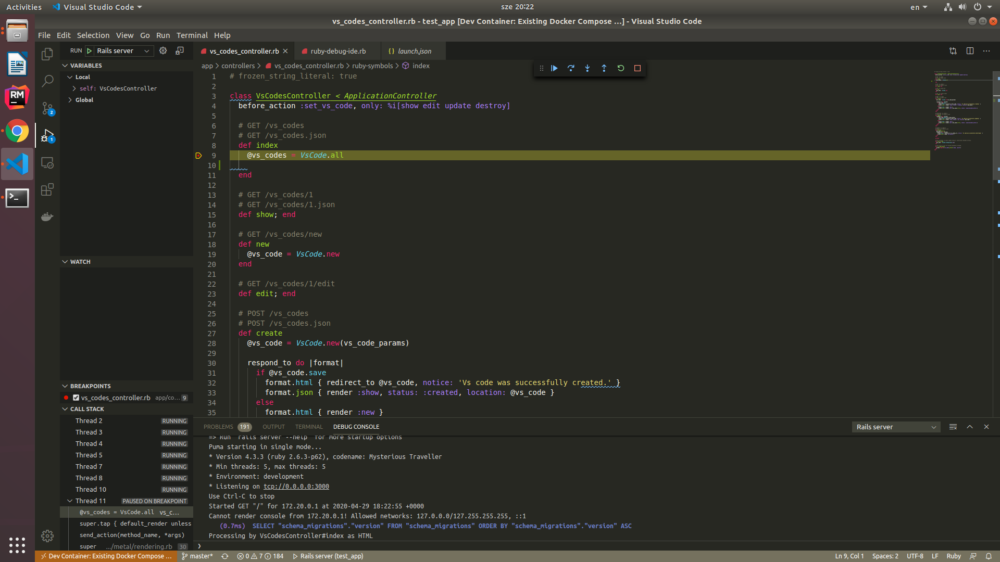
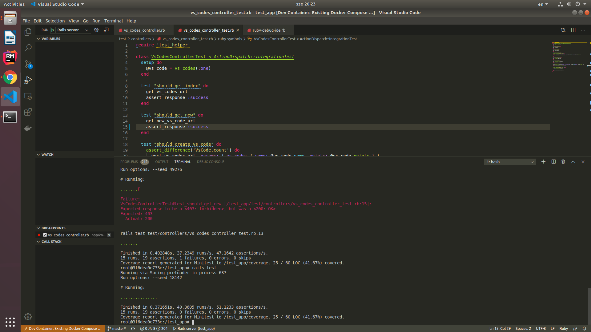

# DevelopmentInContainers

## Bevezetés 

A Docker és egyéb virualizációs technológiák az üzemeletésben már jelentősen elterjedtek, viszont a fejlesztésnél még csak sokkal szűkebb körben használtak. Egy egyszerű Ruby on Rails framework alapú projecten keresztül vizsgáljuk meg, hogy milyen szinten lehet hasznosítani a konténereket már a fejlesztés folyamtában. Az alkalmazásnak szüksége van egy Ruby nyelvet támogató környezetre és egy PostgreSQL adadtbázisra. Ezek a gazdagépre nem lesznek telepítve, kizárólag konténereken keresztül lesznek használva. A RubyMine és Visual Studio Code IDE-ket fogjuk beállitani és használni, hogy több szemszögből is áttekitsük a lehetőségeket. 
 
## Miért érdemes ezzel foglalkozni?

- Gyorsan és egyszerűen el lehet kezdeni egy adott alkalmazáson dolgozni, ha Dockerizálva van. Nincs szükség eszközök letöltésére, konfigurálására, a konténerek inditása után már fejleszthetünk is.
- A fejlesztés és üzemeltetési környezetek közötti eltérések jelentős problémákat okzozhatnak egy alkamazás életciklusa közben. A konténerek által biztositott egységes környezetek csökkentik eznen problémák valószínűségét.
- Több alkalmazás párhuzamos fejlesztése adott eszközök eltérő verzióinak használatával könnyen megoldható, mivel könnyen lehet váltani a konténerek között.


## Konténerek elkszékszítése

A JetBrains csapata elkészitett egy példa projektet, a konténerek elkészítéséhez azt vesszük alapul. Elösször szükségünk van egy konténerre amiben, a Rails keretrendszert tudjuk futtatni. Docker Hub-on nem találtam megfelelő image-et ehez, ezért az alábbi Dockerfile-ban érdemes leirni az image-et:

```Dockerfile
FROM ruby:2.6.3
RUN curl -sL https://dl.yarnpkg.com/debian/pubkey.gpg | apt-key add -
RUN echo "deb https://dl.yarnpkg.com/debian/ stable main" | tee /etc/apt/sources.list.d/yarn.list
RUN apt-get update -qq && apt-get install -y build-essential libpq-dev nodejs postgresql-client yarn
RUN mkdir /test_app
WORKDIR /test_app
COPY Gemfile /test_app/Gemfile
COPY Gemfile.lock /test_app/Gemfile.lock
COPY package.json /test_app/package.json
COPY yarn.lock /test_app/yarn.lock
RUN gem install bundler -v '2.0.2'
RUN bundle install
RUN yarn install --check-files
COPY . /test_app

EXPOSE 3000
```

A fenti image a Ruby 2.6.3-as verzióját tartalmazza alapból, egy Debian rendszeren. Telepítjük még a Yarn és NodeJS csomagagokat, amik kezelik a projectben lévő JavaScript file-okat. Ezután létrehozzuk a test_app mappát és beállítjuk a konténer munkamappájának. Az ezt követő rész felelős az alkalmazás függőségeit képező Ruby és JavaScript könyvtárak letöltéséért. Az utolsó két sor bemásolja a project mappáját a konténerbe, majd 3000 portot elérhetővé teszi a gazdagépen.

A fenti Dockerfile-t felhasználva már elkészithetjük az alkalmazás hálózatát leiró, docker-compose.yml file-t.


```docker
version: '3'
services:
  db:
    image: postgres
    volumes:
      - ./tmp/db:/var/lib/postgresql/data
    environment:
      POSTGRES_HOST_AUTH_METHOD: trust
    ports:
      - "5432:5432"
  web:
    build: .
    # command: bundle exec rails s -p 3000 -b '0.0.0.0'
    command: tail -f /dev/null
    volumes:
      - .:/test_app
      - /test_app/node_modules
    ports:
      - "3000:3000"
      # Ports required for debugging
      - "1234:1234"
      - "26166:26168"
    depends_on:
      - db
  ```

A file első részében létrehozzuk a db szolgáltást, ami a postgres image-en alapú konténer lesz. Az adatbázisban tárolt adatok mappáját összekötjük valamelyik a host egyik mappájával, ezzel perzisztensé téve az adatbázis adatait. Az egyszerűség kedvéért jelszót nem állítunk be, ezt környezeti váltózóként tudjuk beállitani. Majd a host 5432-es portját a konténer 5432-es portjával összekötjük.

A második szolgáltatásban fog futni a rails web szerver, ezért ezt web néven hozzuk létrehozni. Két lehetséges parancsot is felvettem. Az első elinditja a szervert. A második csak futó állapotban tartja a konténer, hogy egyéb fejlsztés közben csatlakozni lehessen hozzá.


Az alap Rails project elkészíŧéséhez kommentezzük ki a --- tartalmazó sorok közötti részeket a Dockerfile-ban. Ezek a sorok majd az elkészült alkalmazás függőségeinek telepitéséért lesz felelős. Ezután létre kell hoznunk a konténereket, és a web szolgáltatásban telepítenünk kell a rails könyvtárat és létrehozni egy új alkalamazást, amit a PostgreSQL adatbázist fogja használni. Ha létrejött az alkalamzás, akkor a hozzá tartozó adatbázist is létre kell hozni. Az alábbi parancsok kiadásával tehetjük ezt meg.  

```sh
docker-compose run web bash
gem install rails 
rails new test_app --database=postgresql
rails db:create
```

A gazdagépen észrevetjük, hogy a létrehozott file-ok tulajdonosa a root felhasználó. Ez nehezíti a file-ok kezelését. Egy kézenfekvő megoldás a problémára, hogy megváltoztajuk a file-ok tulajdonosát:  

```sh
 sudo chown -R $USER .
```

Ez a megoldás hosszútávon nem ideális, mivel mindig meg kell változtatnuk a file-ok tulajdonosát, amikor a konténerből hozzuk létre őket. A Docker lehetőséget biztosít a felhasználói névtért map-elésére. Ezáltal elérhetjük, hogy a konténeren belüli root felhasználóhoz, a konténeren kívül a saját felhasználón tartozzon. Igy a konténeren belül létrehozott file-oknak is mi leszünka a tulajdonosai. Ennek a beállitásához az alábbi lépéseket kell követni.

Állitsuk be a felhasználó által használható UID-ket. Ehez nézzük meg felhasználónevünket `$USER` váltózóban ,valamint a UID-t az `id -u` paranccsal. Az alábbi fáljhoz hozzáadunk egy új bejegyzést, ami tartalmazza a felhasználónevünket(user), a UID-t(1000), és a kiosztható ID-k számát(1), kettősponttal elválasztva. 

```
#/etc/subuid

user:1000:1
```

Végezzük el a fenti műveletet a GID-kre. Annyi különbséggel, hogy itt a saját csoportunk ID-jét használjuk. Ezt az id -g paranccsal kérhetjük le.

```
#/etc/subgid
user:127:1
```
A fenti beállitások elvégzése után, userns-remap tulajdonságot kell beállítani a felhasználónevünkre. Ez megtehetjük kapcsolóként.
```cmd
dockerd --userns-remap=user
```

Vagy daemon.json file-ban.

```json
#/etc/docker/daemon.json
{
  "userns-remap": "user"
}
```

Ezután már a konténerből létrehozott fájlok tulajdonosa a gazdagépen a saját felhasználónk lesz. Az alábbi paranccsal elindihatjuk a konténereinket.

```sh
docker-compose up
```

A localhost 3000-es portán megtekinthetjük a Rails szerver kezdőoldalát.


## RubyMine konfigurálás

Elösször gyorsan áttekintjük, miként állithatjuk be, hogy a RubyMine a konténerünet használja fejlesztés során. Megnyitjuk az IDE-t a projectünk mappájában. A **Settings/Preferences/Languages & Frameworks/Ruby SDK and Gems** oldalra navigálunk. Itt a New remote gombra kattintva felugrik egy dialógus ablak. Ezen beállítjuk a Docker Compose használatát. A lehetséges szolgáltatások közül kiválasztjuk a **web**-et. Az oké gombra kattintás után kiválasztjuk a most létrehozott remote-ot. 

Ahoz, hogy el tudjuk indtani  az IDE-ből a webszervert létre kell, hoznunk a megfelelő konfigurációs file-t. Ezt a **Edit configurations**-menupont használatával tehetjük meg. Ezene belül a **template**-ek közül válasszuk ki a **Rails** konfigurációt. Állitsuk át a használt docker-compose parancsot, **docker-compose exec**-re. Ezután már elindítható a webszerver.

A debuggolás használatához még szükségünk lesz 2 gem-re. Ezek felvételéhez elösször írjuk be az alábbi sorokata a Gemfile-ba.

```Gemfile
#Gemfile

gem 'debase'
gem 'ruby-debug-ide'
```  

Az IDE alt+enter lenyomása után felkínálja, hogy újra build-eli az imaget. Használjuk ezt a lehetősége, hogy a gem-ek belekerüljenek az image-be. Esetleg további funkció eléréséhez is szükség lehet további gem-ek telepítésére, ezt a fentihez hasonló módon tehetjük meg.

## Rubymine használat

A Rails keretrendszer lehetőséget biztosít generátorok használatára, amik segítségével egy CRUD-ot megvalósító, tesztekkel ellátott weboldalt hozhatunk létre. Ennek használatával fogjuk kipróbálni a fejlesztőkörnyezet funkcióit. Ahhoz, hogy parancsokat tudjunk futtatni a konténerben, elöször csatlakoznunk kell hozzá. Ezt az alábbi parancsal tehetjük meg.

```sh
docker-compose exec web bash
```

Alapvetően a RubyMine terminálja nem kapcsolódik a konténerekhez. Több mód is van, hogy a fejlesztőkörnyezet intergrált terminálját automatikusan hozzákapcsoljuk az általunk választott konténerhez. Például a Services oldalon az attach menüpont használatával vagy a Shell Path átállításával. Az egyszerűség kedvért most manuálisan, a fenti paranccsal csatlakozunk a konténerhez, mivel nem lesz errre gyakran szükség. 

Ezután a konténerben navigáljunk el a projectünk mappájába (/test_app) és már, ki is adhatjunk a parancsot, amivel hozzáadunk alapvető funkcionalitásokat az alkalmazásunkhoz.

```sh
rails g scaffold ruby_mine name:string points:integer
```

Ha mindent jól csináltunk, akkor az alábbi sorok jelennek meg a konzolon:



Láthajuk, hogy létrejöttek oldalak (.erb kiterjesztéssel), tesztek, valamint egy kontroller is. Főként ezeket fogjuk használni az IDE tesztelés során. A **zöld háromszög** gomb lenyomásával elindítható a webszerver, ami a [local](http://localhost:3000/)-es címen elérhető.



Ezután próbáljuk ki a többi fontosabb eszköz működését az IDE-ben. A debug, miután beállitottuk, hogy docker exec-el legyen használva, egyből működik a fő alkalmazásban.



Teszteket is könnyedén futhatunk az IDE GUI-ján keresztül. Ehhez navigáljunk egy testeket tartalmazó file-hoz, mondjuk **test/controllers/ruby_mines_controller_test.rb**, itt a **jobb egérgomb** lenyomásával megjelennek a kontextusfüggő lehetőségek. Ezekközül válasszuk a **Run Minitest:**-lehetőséget. A tesztek futásának eredményét is megjeleníti a fejesztőkörnyezet. Emellet van lehetőség a tesztek közül csak egyet futttani, valmint debug módban is elindíthatjuk a teszteket.



A code-completion és az inteligens navigáció is működik, bár ezekhez nem szükséges a nyelvi környezet, az IDE önellóan nyújtja ezeket a szolgáltatásokat. Szinte minden lehetőség elérhető a konténerből, amit a natívan használt verzió támogat, egy kivételével. A nativ ruby-t használó IDE-ben van lehetőség egyes tesztek futtaása után kilistázni a tesztlfedettséget. Valamint az érintett sorokat is szinezi a környezet, annak függvényében, hogy érintette őket az adott futás. Ez lehetőség még konténeres használat során nem eléhető, de a fejlesztők már tudnak a [problémáról][1].


## Visual Studio Code konfigurálás

Nyissuk meg a projectet VSCode-ban. Első lépésként a **telepitsük a szükséges extension-öket**. Ezek az alábbiak:
- Remote - Containers
- Ruby
- Ruby Solargraph

Miután ezeket telepitettük inditsuk **újra az IDE-t** és inditsuk el **docker-compose up** parancs kiadásávala a konténereket. Ezután a bal oldalon lévő **Docker logóra** kattinva válasszuk ki **rails_developmet_in_containers_web** konténert, és válasszuk az Attach Visual Studio Code lehetőséget. Ezután telepítsük a konténerbe is a megfelelő extension-öket. Ezt a **felhő gombra** kattinva egyszerűen megtehetjük. Ezután az **Open Folder** gomb használatával nyissuk meg /test_app mappát. A Solargraph müködéséhez extra beállításokat kell elvégeznünk, a források között található [linken][2] ez is megtekintehtő,de ezt itt nem írnám le részletesen. Már csak egy lépés van, hogy elkezdhessük használi a fejlesztő környezetet. A **launch.json** fileban vegyük fel a Listen for **rdebug-ide, Rails server** konfigurációkat. A VSCode által javasolt előre definiált lehetőségek teljesen megfelelők. Ezek után már használhatjuk az okos navigálást, code-completion-t, valamit debugolhatjuk és tesztelhetjük az alkalmazásunk.











 
## Források
- rubymine setup: https://www.jetbrains.com/help/ruby/using-docker-compose-as-a-remote-interpreter.html
- alap image: https://github.com/JetBrains/sample_rails_app
- konténeren belül létrehozott fájlok jogosultsága problémaleírás: https://jtreminio.com/blog/running-docker-containers-as-current-host-user/
- megoldás: https://www.jujens.eu/posts/en/2017/Jul/02/docker-userns-remap/
- docker user namespace dokumentáció: https://success.docker.com/article/introduction-to-user-namespaces-in-docker-engine
- vscode debug setup: https://share.atelie.software/using-visual-studio-code-to-debug-a-rails-application-running-inside-a-docker-container-3416918d8cc8
- vscode Dolargraph (language server) setup: [2]
 
[2]:https://solargraph.org/guides/rails

- tesztlefedettség vizualizáció issue: [1]

[1]: https://youtrack.jetbrains.com/issue/RUBY-12337
