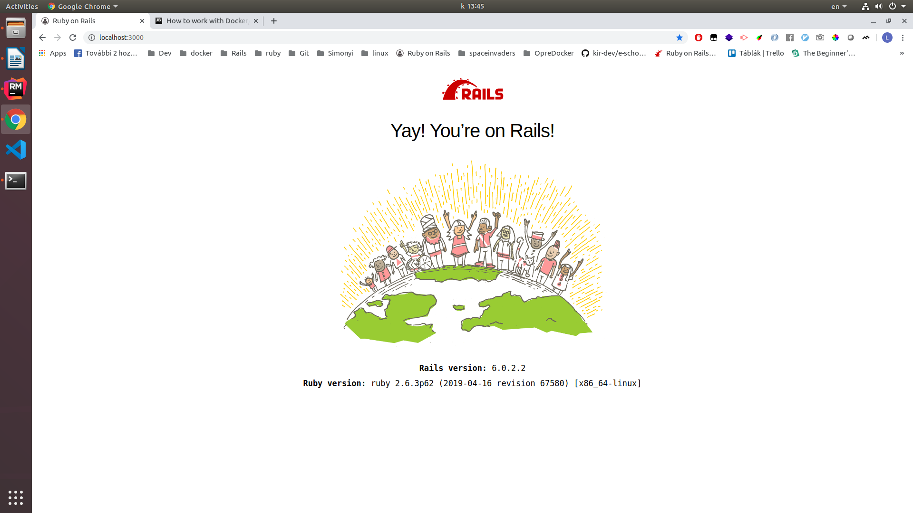

# DevelopmentInContainers
## Bevezetés 

Előkészités

Szükségünk van egy docker image-re ami alapján létrehozhatjuk a konténereinket. Szerencsére sok már elkészitett kép közül választhatunk. Általában a DockerHUB oldalon érdemes megkeresni a megfelelő képet, de a JetBrains RubyMine csapata elkészitett egy remek példaprojectet, amiben a Dockerfile és a docker-comopse.yml is megtalálható nekünk megfeleő tartalommal, ezért azokat fogjuk használi kisebb módosításokkal.

Kell egy test projek is amit a tesztelés során használhatunk. Ezt is konténerből fogjuk létrehozni. A Dockerfile-ban kikommentezzük a projekt bemásolásával és a gem-ek telepitésésvel kapcsolatos részeket, majd az alábbi parancsokkal létrehozzuk a projectet. 

```sh
docker-compose run web bash
gem install rails 
rails new test_app --database=postgresql

```

Majd a konténerenből kilépés után a teljes mappa tulajdonosát átállítjuk a jelenlegi felhasználóra.

```sh
 sudo chown -R $USER .
```
Ezután a test_app/test_app mappa tartalmát simán átmásoljuk a test_app mappába. 
Az alkalmazás első futtatásakor létre kell hozni az adatbázist. Ez a web conténerből az alábbi paranccsal tehető meg.

```sh
 rake db:create
```

Ezután a localhost:3000 címen megtekinthető a weboldal.

A továbbiakban nem szeretnénk rögtön elinitani a rails szervert, ezért módositjuk a web szolgáltatás parancsát, hogy csak egy filet figyeljen.

```docker-compose
#docker-compose.yml

command: tail -f /dev/null
```



## RubyMine
Megnyitjuk az IDE-t a projectünk mappájában. A Settings/Preferences/Languages & Frameworks/Ruby SDK and Gems
hez navigálunk. Itt a New remote gombra katiintva felugrik egy dialógus ablak beállítjuk a Docker Compose használatát, valamint a használt szolgáltatást a web -re. Az oké gombra kattintás után kiválasztjuk az új remote-ot. Ezután elkezdődik az indexelése. Ennek befejeződése után már a konténerben fejleszthetünk. Első lépésként indítsuk el a Rails servert. Az Edit Configurations menüben a Development konfigurációban állítsuk át a docker compose parancsot excec-re. Ezután a zöld nyil megnyomásakor el is indul az alaklmazásunk.

Elösször nézzük meg, hogyan lehet gem-eket hozzáadni az alkalmazásunkhoz. Vegyünk fel néhány debuggolást segítő gem-et a Gemfile-ba.

```Gemfile
#Gemfile

gem 'debase'
gem 'ruby-debug-ide'
```  
Az IDE alt+enter lenyomása után felkínálja, hogy újra build-eli az imaget. Erre szükség van, hogy az új gem-ek bekerüljenek a konténerbe. Ez kicsit időigényes, mivel az összes gem-et letölti újra a konténer, de mivel csak ritkán kerülnek új gemek felvételre, ezért ez nem túl nagy probléma.

Most már elkezdhetjük tesztelni a konténert. Elösszöris az alábbi paranccsal generáljunk pár tesztoldalt.

```sh
rails g scaffold ruby_mine name:string points:integer
```

Az oldalak sikeresen létrejönnek, de mikor a host-on szerkeszteni szeretnénk, akkor problémába ütközünk. A konténerben létrehozott file-ok tulajdonosa a root user, ezért csak olvasni tudjuk, szerkeszteni nem. Megoldás lehetne, hogy chow paranccsal ezt megváltoztatjuk, de ez nem túl jó megoldás, mivel ezt mindig meg kéne tennünk, amikor új file-okat hozunk létre a konténeren belülről. Ha a konténereben létrehozunk egy új felhasznalot és azzal próbáljuk létrehozzni a file-okat akkor is hibába ütközünk, mivel igy a konténeren belül nincs root jogunk. 

A megoláshoz a Linux user namespace-t fogjuk használni. Az /etc/subuid file-hoz hozzádunk az alábbi sort.

```
#/etc/subuid

user:1000:1
```
A user a felhaszlánónév $USER, 1000 pedig id -u használatával állítjuk elő. A sor beállítja, hogy a felhasználó az 1000-től kezdve 1 db UID kaphat, azaz csak az 1000-et, így mindig ugyan azt a UID-t használja. Hasonló módon beállítjuk a csoporot is.

```
#/etc/subgid
user:127:1
```

A 127 a docker csoport guid-ja. Igy garanráljuk, hogy a használt csoport is mindig az általunk megadott legye majd. Érdemes észben tartani, hogyha átállitjuk a docker által használt id tartományokat, akkor az eredeti tartományban létrehozott image-ek nem lesznek élérhetők, újra le kell pullolni őket. Az alábbi parancsal adhatjuk meg, hogy a docker deamon használja az általunk megadott map tartományokat.

```cmd
dockerd --userns-remap=user
```

Vagy json file-ban is megadhatjuk, ha alapértelmezetten így szeretnénk használni.

```json
#/etc/docker/daemon.json
{
  "userns-remap": "user"
}
```
A fenti beállitások elvégzése után, már szerkeszthetők lesznek, a konténeren kivül is, a konténerben létrehozott fájlok.

Ezután próbáljuk ki a többi fontosabb eszköz működését az IDE-ben. A debug, miután beállitottuk, hogy docker exec-el legyen használva, egyből működik a fő alkalmazásban.


Teszteket is könnyedén futhatunk az IDE GUI-ján keresztül.


A code-completion és az inteligens navigáció is működik.

## Források
- alap image: https://github.com/JetBrains/sample_rails_app
- konténeren belül létrehozott fájlok jogosultsága problémaleírás: https://jtreminio.com/blog/running-docker-containers-as-current-host-user/
- megoldás: https://www.jujens.eu/posts/en/2017/Jul/02/docker-userns-remap/